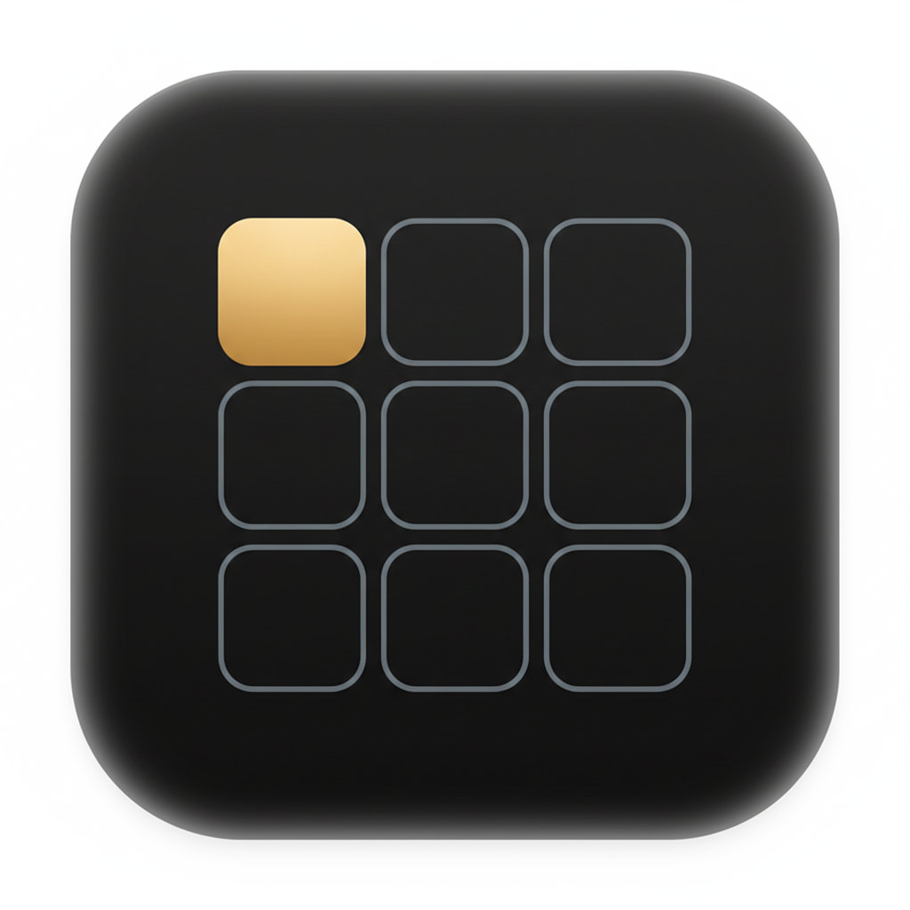
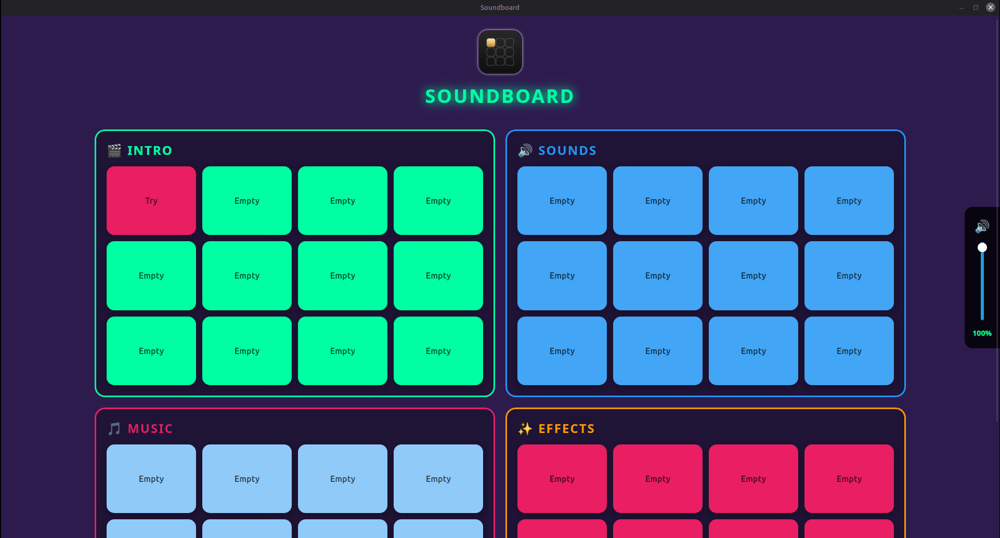
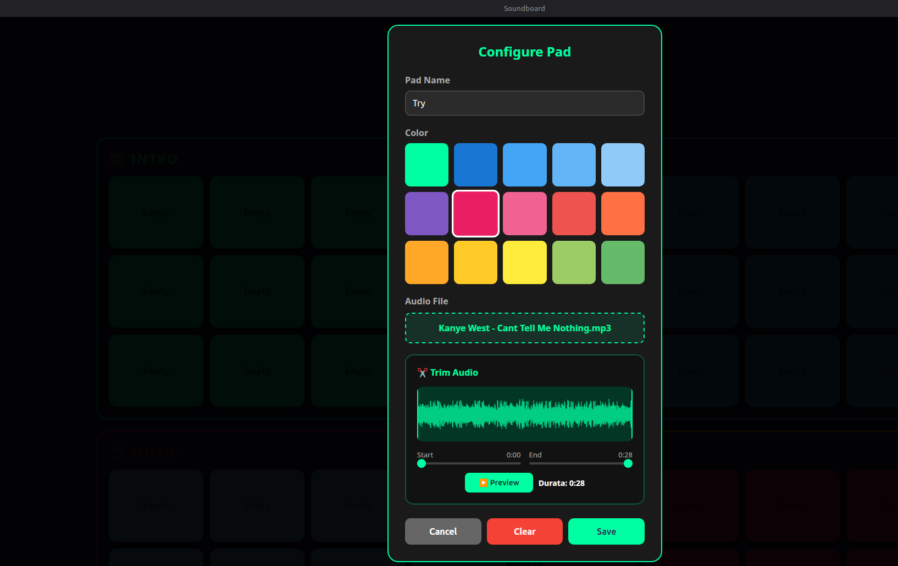

<h1 align="center">🎵 Soundboard</h1>

<p align="center">
  A professional soundboard with 48 customizable pads, integrated audio trimming, fade in/out effects, and multi-language support.
</p>

<p align="center">
  
</p>

## 📸 Screenshots

<p align="center">
  
  
</p>

## ✨ Features

### 🎛️ 48 Customizable Pads
- **4 Categories**: Intro, Sounds, Music, Effects
- **12 pads per category** with customizable colors
- **Audio assignment** with custom names

### ✂️ Integrated Audio Trimmer
- **Real-time waveform** visualization
- **Precise selection** of start and end points via sliders
- **Preview** of selected portion
- **Duration timer** dynamically updated
- **Automatic saving** of trimmed portion only

### 🎚️ Volume Control
- **Always visible** volume sidebar
- **Master control** for all pads
- **Quick mute** with one click

### 🎭 Professional Audio Effects
- **Fade In** of 1 second on start
- **Fade Out** of 3 seconds on stop
- **Smooth transitions** between tracks

### 🌍 Multi-language
- **Italiano** 🇮🇹
- **English** 🇬🇧
- Language selection on first launch

### 💾 Local Storage
- **localStorage**: All data saved locally
- **Base64 audio**: No server needed
- **Persistence**: Your pads remain after restart

## 🎮 How to Use

### Adding Audio to a Pad

1. **Click on empty pad** → Configuration modal opens
2. **Enter pad name**
3. **Choose color** from palette
4. **Select audio file** (MP3, WAV, OGG, etc.)
5. **(Optional) Trim audio**:
   - Move **Start** slider to set start point
   - Move **End** slider to set end point
   - Click **▶️ Preview** to listen to selection
   - View **duration** in real-time
6. **Click Save**

### Audio Playback

- **Single click on populated pad** → 
  - ▶️ **Start audio** with 1-second fade in
  - ⏹️ If already playing: **Stop with 3-second fade out**

- **Long press (hold down)** → 
  - Opens **edit modal**
  - Can change name, color, audio

### Pad Management

- **Clear**: Removes everything from pad
- **Cancel**: Close without saving
- **Save**: Confirm changes

### Volume Control

- **Vertical slider** on right side of screen
- **🔊 Click icon** for quick mute/unmute
- **Percentage** displayed in real-time

## 📋 System Requirements

- **Operating System**: Linux (Ubuntu 20.04+, Debian 10+, Linux Mint 20+)
- **Browser**: Chromium, Chrome, or Firefox
- **RAM**: 512 MB minimum
- **Storage**: 50 MB for application + space for audio

## 🚀 Installation

### .deb Package

```bash
# Download latest release from GitHub
wget https://github.com/Chazy12/simplesoundboard/releases/download/v1.0.0/soundboard_1.0.0_amd64.deb

# Install
sudo dpkg -i soundboard_1.0.0_amd64.deb

# Launch application
soundboard
```

```bash
### Reset the app
# Reset the app without uninstalling
rm -rf ~/.local/share/com.soundboard.app ~/.local/share/soundboard ~/.config/com.soundboard.app ~/.cache/com.soundboard.app
```

```bash
### Uninstall the app
# Uninstall and clean residue
sudo apt purge simplesoundboard -y && rm -rf ~/.local/share/com.soundboard.app ~/.local/share/soundboard ~/.config/com.soundboard.app ~/.cache/com.soundboard.app && echo "Disinstallazione e pulizia completata."
```
## ⌨️ Keyboard Shortcuts

| Action | Key |
|--------|-----|
| Close modal | `ESC` |
| Save pad | `Enter` (in modal) |

## 🛠️ Technologies Used

- **HTML5**: Structure
- **CSS3**: Responsive styling
- **Vanilla JavaScript**: Application logic
- **Web Audio API**: Audio processing and trimming
- **localStorage API**: Data persistence
- **Canvas API**: Waveform visualization

## 📊 Limitations

- **Audio size**: Max 5 MB per file (localStorage limitation)
- **Number of pads**: 48 fixed (12 per category)
- **Audio formats**: Browser-supported (MP3, WAV, OGG, M4A)

## 🐛 Troubleshooting

### No audio playback
- Check master volume (right sidebar)
- Verify audio format is supported
- Reload the page

### Trimmer not working
- Ensure audio file is valid
- Try a smaller file
- Use MP3 or WAV format

### Pads not saving
- Verify localStorage is enabled in browser
- Check total data size (max ~5-10MB)
- Try clearing some pads

## 📝 Changelog

### v1.0.0 (2026-01-16)
- 🎉 Initial release
- ✂️ Integrated audio trimmer
- 🌍 Multi-language support (IT/EN)
- 🎭 Fade in/out effects
- 💾 Local storage

## 📄 License

This project is distributed under the MIT License.

## 👤 Author

**Chazy**

## 🤝 Contributing

Contributions are welcome! Feel free to open issues or pull requests.

## ⭐ Support

If you like this project, leave a star on GitHub!

---

Made with ❤️ for the audio community
